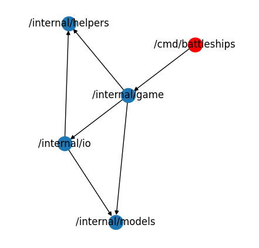
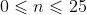
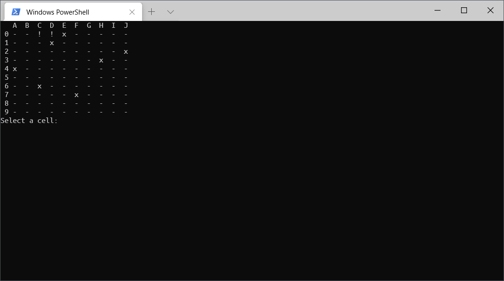

# Battleships

Golang 1.14, `github.com/codemicro/cs-battleships`, 321 lines of code

#### To build

```bash
go get -u github.com/codemicro/cs-battleships
go build github.com/codemicro/cs-battleships/cmd/battleships
```

#### To run

```bash
sudo chmod +x ./battleships
./battleships
```

## Contents

* What is battleships?
* Success criteria
* Project structure
* Assorted components
  * Clearing the console
  * Collecting user input
  * Numbering the board with letters
* Game components
  * Creating and storing an ocean
  * Displaying the ocean 
  * Hit detection
* The main game loop
  * Restarting the game
* The entrypoint
* What could be improved?
* Evaluation

## What is battleships?

Battleships is typically a two player game where players compete to destroy the other players' ships by guessing their locations. The first player to destroy the other's ships is the winner.

This project is a single player version of battleships, where the locations of boats are randomly generated. The job of the player is to guess their location, and the game finishes when all boats have been located.

## Success criteria

* The program should automatically generate an ocean with boats in random locations
* The program should display the ocean using text characters
* The program should allow the user to input guesses and feedback on if those guesses have been successful in finding a ship

## Project structure

The vast majority of the code in this project is stored in packages in the `/internal` directory, which contains the following packages:

* `game`: contains logic related to playing the game and managing the ocean.
* `helpers`: contains functions required in different places in the game that don't really fit into any of the other packages
  * For example, functions to clear the console and functions to convert letters into numbers are contained in this package.
* `io`: contains functions to aid with displaying content to and collecting input from the user.
* `models`: contains the structs used throughout the app
  * Specifically, it's just one struct - `OceanCell`

Code is broken down into small functions as much as possible, to ensure that code is not duplicated and to make reusing code easier.

In order to prevent import loops, a sort of package hierarchy is in place: the `main` package (seen below as `/cmd/battleships`) imports the `game` package, which imports `helpers`, `io` and `models`. Those packages cannot import from `game` as that would cause an import loop, but they can import from each other. The import graph of the project eded up looking like this:



Let's get to writing some components!

## Assorted components

### Clearing the console

During the game, it will be necessary to clear the console periodically to prevent it becoming to cluttered.

Unlike in C# and other languages, Go has no built in way to do this. If we want to clear the console, we have to write a function that manually calls the system command.

```go
package helpers

// ...

func ClearConsole() {
	var cmd *exec.Cmd
    // Depending on the platform we're running on, we need to choose a different command.
	if runtime.GOOS == "windows" {
		cmd = exec.Command("cmd", "/c", "cls")
	} else {
		cmd = exec.Command("clear")
	}
    // The output of the command is set to the current command line that we're playing the game on.
	cmd.Stdout = os.Stdout
	_ = cmd.Run() // Run that command and ignore any errors
}
```

### Collecting user input

If a user is going to play the game, they need a way to input information into it. This will then need to be validated to make sure that the coordinate provided is a valid location on the board. All of this can be rolled into one function.

```go
package io

// ...

var (
	scanner   = bufio.NewScanner(os.Stdin)
	cellRegex *regexp.Regexp
)

func init() {
    // The init function is run once when the package is first loaded.
	var err error
    cellRegex, err = regexp.Compile(`^\w\d$`) // Matches: start of string, one word character, one digit, end of string. For example A7 matches, BB24 does not.
	if err != nil {
		panic(err) // If there's something wrong with our regex, say so and quit.
	}
}

func TakeInput(prompt string) string {
    // TakeInput is just a wrapper for a couple of other functions
	fmt.Print(prompt)
	scanner.Scan()
	return scanner.Text()
}

func GetCell() (x int, y int) {
    // Enter an infinite loop to ensure that we get valid input from the user
	for {
		input := TakeInput("Select a cell: ")
        // See if the user's input is okay
		if cellRegex.Match([]byte(input)) {

            // Split the user input into an X and Y component. Get an integer from the letter, and convert the number to integer format from the string.
			x = helpers.GetCharNumber(strings.ToUpper(string(input[0])))
			y, _ = strconv.Atoi(string(input[1]))

            // Check if the selected cell is within the bounds of the board.
			if !(x > OceanWidth || y > OceanHeight) {
				return
			}
		}
		fmt.Println("Invalid cell") // Tell the user their input is invalid and loop round again to let them try again.
	}
}
```

Once we've got this setup, letting the user select a cell is as simple as:

```go
x, y := io.GetCell()
```

### Numbering the board with letters

Coordinates (at least, in a battleships game) are comprised of a letter and a number. Internally, we're going to be referencing locations in the ocean using integers. Somehow we have to turn a letter into a number before we can use it.

The best way to do this is to write two helper functions.

First we should write a function to turn an integer (in the range ) into an alphabet letter. In every programming language, every character has an assigned number, and alphabet letters all have consecutive numbers. Knowing this, we can do the following magic to get an alphabet letter from an "index" of that letter.

```go
package helpers

// ...

func GetAlphabetChar(i int) string {
    // Cast the rune A (rune == char but in Go) to an integer to use as a starting point.
    // Add i to that integer
    // Turn the resultant integer back into a rune
    // Turn that rune into a string
   	// Return that string
	return string(rune(int('A') + i))
}
```

We'll also need to get an integer from an alphabet character in places. The inverse of the above function looks like this.

```go
package helpers

// ...

func GetCharNumber(i string) int {
    // Convert the string to an array of runes and select the first one
    // Convert that rune into an int
    // Take the integer version of rune A from the calculated int
    // Return that value
	return int([]rune(i)[0]) - int('A')
}
```

By adding these two functions, we avoid the need to have an array that contains all the letters of the alphabet.

## Game components

### Creating and storing the ocean state

The heart of a battleships game is the ocean, which is in our case is going to be a 10x10 grid. Each cell in the grid has three different attributes attached to it: `Occupied`, `Hit` and `Guessed`.

This is achieved using a struct called `OceanCell`.

```go
package models

// ...

type OceanCell struct {
	Hit      bool
	Occupied bool
	Guessed  bool
}
```

This struct is then used in the `Ocean` variable to store the current state of the game. It's of type `[][]models.OceanCell`, which is an array of arrays of our `OceanCell` struct (Go doesn't have two-dimensional arrays). However - just declaring the variable (`var Ocean [][]models.OceanCell`) in Go will not fill it with default values, instead just creating an empty array. To actually create a matrix of `OceanCell`s, we use the built in `make` function in Go.

```go
package game

// ...

func CreateOcean(oceanWidth, oceanHeight int) (proto [][]models.OceanCell) {
	proto = make([][]models.OceanCell, oceanHeight) // Make the top level array
	for y := 0; y < oceanHeight; y++ {
		proto[y] = make([]models.OceanCell, oceanWidth) // Make the subarrays
	}

	// ...

	return
}
```

However - this just creates an empty ocean. A game of battleships needs boats, right? We need to write some boat placement code.

```go
package game

// ...

var shipsToPlace = []int{5, 4, 3, 3, 2}

func CreateOcean(oceanWidth, oceanHeight int) (proto [][]models.OceanCell) {
    
    // ...
    
    // shipsToPlace is an array of integers that represent ships to be placed in the ocean.
	for _, shipLen := range shipsToPlace {
		// First, a random boat orientation is chosen.
		isShipHorizontal := Random.Intn(2) == 0

		var x int
		var y int
        
		// Enter an infinte loop
		for {
			// Pick a random coordinate on the board
			x = Random.Intn(oceanWidth)
			y = Random.Intn(oceanHeight)

            // Now we adjust those coordinates to ensure that the current ship won't overflow the board
            // In addition, we also check for collisions with other ships already on the board.
			if isShipHorizontal {
				// Prevent overflow by moving the ship left
				for x+shipLen > oceanWidth {
					x--
				}

				// Check for collisions. If there is a collision, return to the beginning of the loop
                // and generate new coordinates.
				for i := 0; i < shipLen; i++ {
					if proto[x+i][y].Occupied {
						continue
					}
				}

			} else {
				// Now we do the same thing, but for the y direction
                
				for y+shipLen > oceanHeight {
					y--
				}

				// Check for collisions
				for i := 0; i < shipLen; i++ {
					if proto[x][y+i].Occupied {
						continue
					}
				}
			}
            
            // If we've reached this point, we've adjusted the ship location so it's not overflowed
            // and we've ensured that there're no collisions.
			break
		}

		// Finally, we can set the cells of the ship to occupied in the ocean array.
		if isShipHorizontal {
			for i := 0; i < shipLen; i++ {
				thing := proto[x+i][y]
				thing.Occupied = true
				proto[x+i][y] = thing
			}
		} else {
			for i := 0; i < shipLen; i++ {
				thing := proto[x][y+i]
				thing.Occupied = true
				proto[x][y+i] = thing
			}
		}
	}
    
    // Because of Go magic, this is equivalent of "return proto"
    return 
}
```

### Displaying the ocean

Creating and storing the ocean is all well and good, but at the moment there's no way for the user to see it.

```go
package io

// ...

func ShowOcean(ocean [][]models.OceanCell) {
    helpers.ClearConsole()

	fmt.Print("  ") // In order to make everything line up nicely

    // Print the letters at the top of the board
	for i := 0; i < len(ocean); i++ {
		fmt.Printf(" %s ", helpers.GetAlphabetChar(i))
	}

	fmt.Println()

    // Iterate over the ocean (y first)
	for y := 0; y < len(ocean); y++ {
		fmt.Printf(" %d", y) // Print the row number
        
        // Iterate over the ocean in the x direction
		for x := 0; x < len(ocean[0]); x++ {
			
            // Get the current cell, and depending on if the cell is hit, or has been guessed before,
            // print out an "!" or a "x" respectively.
			currentCell := ocean[x][y]
			var marker string
			if currentCell.Hit {
				marker = "!"
			} else if currentCell.Guessed {
				marker = "x"
			} else {
				marker = "-"
			}
            // Print out the marker (with some padding)
			fmt.Printf(" %s ", marker)

		}
		fmt.Println()
	}
}

```

### Detecting if all ships are hit

Our game of battleships finishes when the player has hit all the ships, so we need a way to detect this.

```go
package game

// ...

func AreShipsRemaining() (areShipsRemaining bool) {
	// Iterate over every cell in the ocean, and if even one is occupied and not hit, return true.
    // Else return false.
	for y := 0; y < io.OceanHeight; y++ {
		for x := 0; x < io.OceanWidth; x++ {
			if Ocean[x][y].Occupied && !Ocean[x][y].Hit {
				areShipsRemaining = true
				return
			}
		}
	}

	return
}
```

## The main game loop

Now, we can bring all the components we've written together. In order to start the game, all you have to do is a single function call. Doing this allows us to reduce the amount of code in the file containing the entrypoint.

```go
package game

// ...

func Start() {
	for {
        io.ShowOcean(Ocean)
		x, y := io.GetCell() // Let the user select a year.
		selectedCell := Ocean[x][y] // Here, Golang does not return a pointer to that value, so we cannot modify the cell value using Ocean[x][y].Hit = true. We have to make a copy of this value and reassign it to the array when we're done.
        
		if selectedCell.Occupied {
			selectedCell.Hit = true
			fmt.Println("You hit something!")
		} else if selectedCell.Guessed {
			fmt.Println("You already guessed this one!")
		} else {
			fmt.Println("Nothing here!")
		}
        
		selectedCell.Guessed = true
		Ocean[x][y] = selectedCell
		time.Sleep(time.Second) // So the user has a moment to see the message that's been printed out before the screen is cleared

		// ...
        
    }
}
```

### Restarting the game

Once all ships have been hit, the user can choose if they'd like to play another round. Because the code used to generate a new ocean with random ships is its own separate function, it's trivial to generate a new ocean and restart the game with that.

```go
package game

// ...

func Start() {
    for {
        
        // ...
    
	    if !AreShipsRemaining() {

			helpers.ClearConsole()

			fmt.Println("You hit all the ships, well done!")

			if strings.ToLower(io.TakeInput("Play again? y/N ")) != "y" {
				return
			}

			SetupNewGame()

		}
	}
}
```

## The entrypoint

With that, we can write the entrypoint of our program.

```go
package main

import (
	"github.com/codemicro/cs-battleships/internal/game"
)

func init() {
	game.SetupNewGame()
}

func main() {
	game.Start()
}

```

Then we can build the game, and run it!



## What could be improved?

* A scoring system could be added to record the amount of guesses a player takes to finish the game
  * This could be stored as JSON or similar and then used to show a leaderboard
* The displayed board could be made to look better using a variety of characters like █ and ▃
* The displayed board could have colours
* More boat sizes could be added/randomly generated to give the more variation in the game
* The `models` package shouldn't exist.
  * Ideally, the `OceanCell` struct should be contained within the `game` package since that's where it's used. As a result, the `models` package kinda doesn't need to be there.
  * If this were to be implemented, other parts of the project would need to be restructured to avoid a circular import.

## Evaluation

All in all, the program produced has met and exceeded the success criteria.

* The program should automatically generate an ocean with boats in random locations
  * This has been exceeded with the addition of not just placing single cell boats, but boats of varying sizes.
* The program should display the ocean using text characters
  * This has been met.
* The program should allow the user to input guesses and feedback on if those guesses have been successful in finding a ship
  * This has been met.
